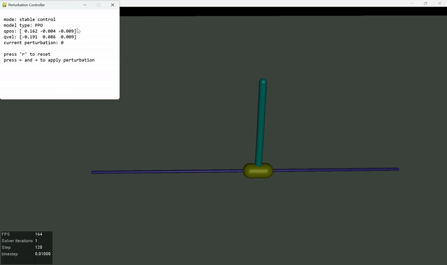
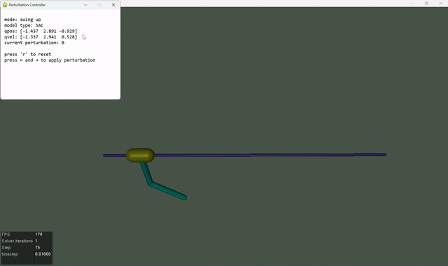
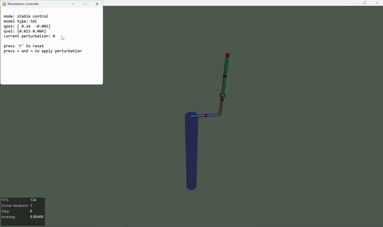
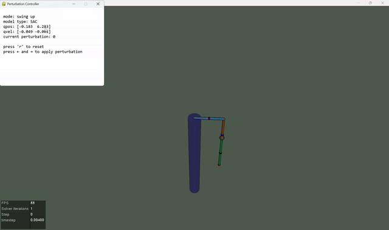
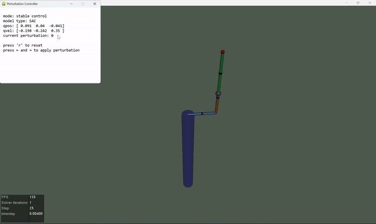
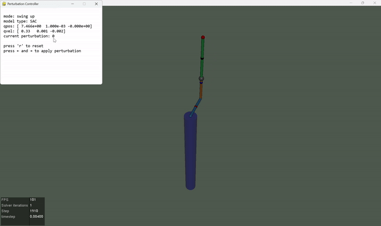

# Implement RL on Many Inverted Pendulums

This repository contains implementations of Reinforcement Learning (RL) algorithms applied to various inverted pendulum tasks. Refer to the control repo for a more cpmplete view of this research topic: [zirconium](https://github.com/Ancient-Gadget-Laboratory/zirconium)

## Results

Below are some simulation showcases:

- stable and swing-up task of inverted double pendulum




- stable and swing-up task of rotary inverted pendulum




- first attempt on rotary inverted double pendulum




- investigate the *BANNA* state


- successful swing-up of rotary inverted double pendulum using manual perturbation and automatic action selection




## File Structure

```bash
.
├── assets              # model files and video showcases
├── backup              # storage for well-performing models
│   ├── archive         # some aborted experiments
│   └── core            # core models for each stage
├── benchmark           # benchmark scripts for performance evaluation
├── data                # trained models
├── log                 # log files, yet not used
├── onnx                # exported ONNX models
├── src                 # source training codes
├── test                # test scripts for new features
├── tools               # utility scripts, useful for remote training
├── README.md
└── requirements.txt
```

> [!NOTE]
>
> - The main difficulty of this project lies in the design of the reward function, which is crucial for the success of double pendulum tasks. Currently, the draft reward functions are removed to avoid confusion, yet you can find them in the commit history if you are interested in the design and trial process.
> - RL algorithms such as PPO, SAC, and TD3 are tested in this project, and SAC behaves the best in most cases.
